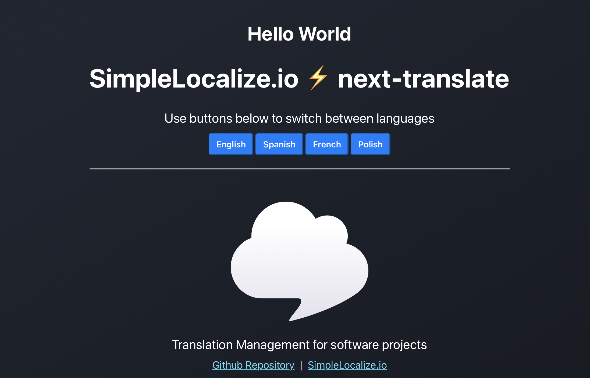

This is a [Next.js](https://nextjs.org/) project bootstrapped with [`create-next-app`](https://github.com/vercel/next.js/tree/canary/packages/create-next-app).

## Translations location

Translations are placed in `/locales/{lang}/{ns}.json`

- `{ns}` - namespace, allows you to split translation keys into multiple files
- `{lang}` - language

In this example there are two namespaces: `common` and `home` and 4 locales: `en`, `es`, `fr`, `pl`.


```bash
.
├── en
│   ├── common.json
│   └── home.json
├── es
│   ├── common.json
│   └── home.json
├── pl
│   ├── common.json
│   └── home.json
└── fr
    ├── common.json
    └── home.json
```

## next-translate configuration

Install next-translate for NextJS

```bash
npm install --save next-translate
```

Create a configuration file in project root.

📦 file: ./i18n.json
```json
{
  "locales": ["en", "es", "fr", "pl"],
  "defaultLocale": "en",
  "pages": {
    "*": ["common"],
    "/": ["home"]
  }
}

```

## NextJS + i18n configuration

Import i18next configuration file into `next.config.js`

```typescript
// 📦 file: ./next.config.js
const nextTranslate = require('next-translate')

module.exports = nextTranslate({
  webpack: (config, { isServer, webpack }) => {
    return config;
  }
})
```

## SimpleLocalize configuration

💿 Install [SimpleLocalize CLI](https://simplelocalize.io/docs/cli/get-started/)
```bash
curl -s https://get.simplelocalize.io/2.0/install | bash
```

🧷 Create configuration file

```yaml
# 📦 file: ./simplelocalize.yml
apiKey: YOUR_PROJECT_API_KEY
downloadFormat: single-language-json
downloadPath: ./locales/{lang}/{ns}.json

uploadFormat: single-language-json
uploadPath: ./locales/{lang}/{ns}.json
```

⤵️ [Download translations](https://simplelocalize.io/docs/cli/download-translations/) to `./public/locales` directory
```bash
simplelocalize download
```

⤴️ [Upload translations](https://simplelocalize.io/docs/cli/upload-translations/) from `./public/locales` directory
```bash
simplelocalize upload
```

> You can [automate process of adding translation keys](https://simplelocalize.io/docs/integrations/i18next/) from project to SimpleLocalize.


## Usage

Example usage can be found in `pages/index.tsx`.

```typescript
import useTranslation from 'next-translate/useTranslation'

//translations from common.json
const { t } = useTranslation('common')
console.log(t('LEARN_MORE')) // output: Learn more

//translations from home.json
const {t: homeT} = useTranslation('home');
console.log(homeT('HELLO_WORLD')) // output: Hello world
```


## Try out this demo

First, run the development server:

```bash
npm run dev
```

Open [http://localhost:3000](http://localhost:3000) with your browser to see the result.

You can start editing the page by modifying `pages/index.tsx`. The page auto-updates as you edit the file.

